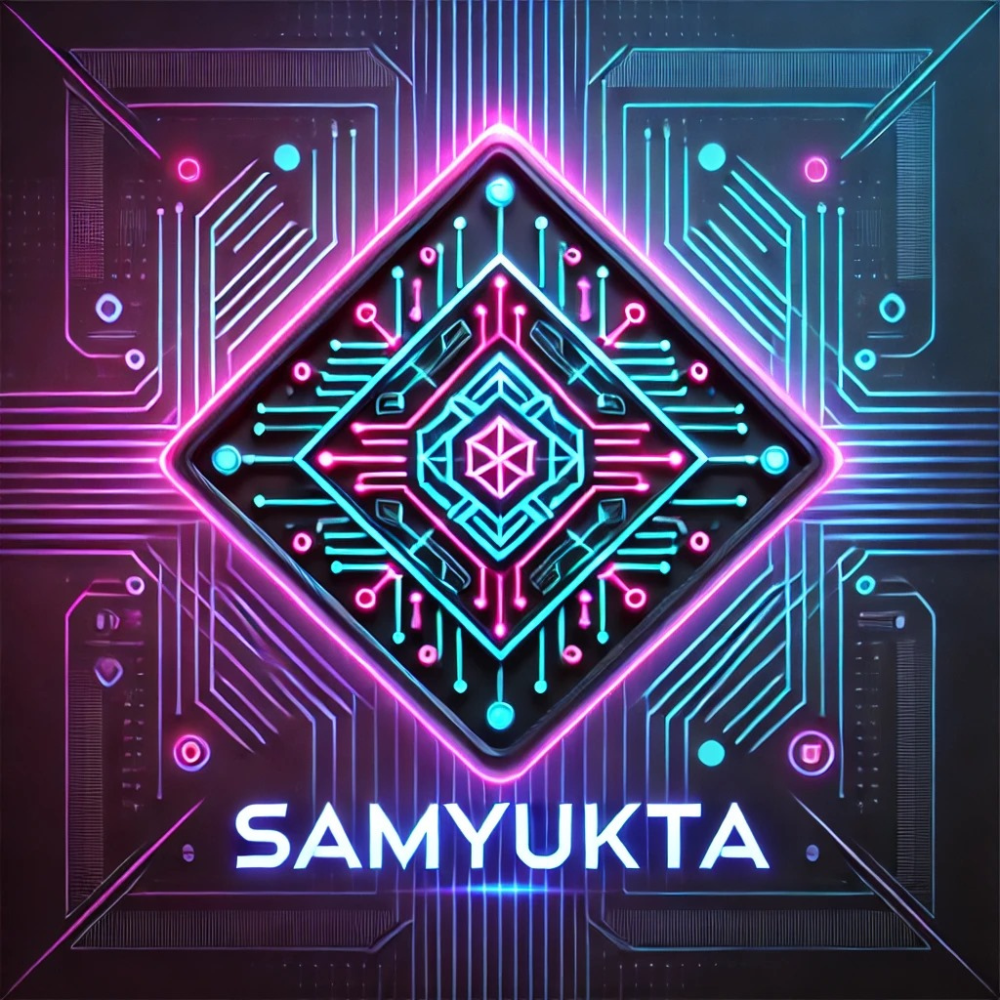

  

<!-- &nbsp;&nbsp;
&nbsp;&nbsp; -->
&nbsp;&nbsp;

Hey there 👋  

I'm **Samyukta Gade**, a passionate **AI and full-stack developer** who loves solving real-world problems with **machine learning, deep learning, and cloud computing**. I enjoy building innovative solutions and sharing what I learn along the way.  

🚀 **Currently working on:** AI-powered applications, cloud automation, and intelligent web platforms.  

📌 **Notable Projects:**  
🔹 **Real-Time Emotion Recognition** – Detecting facial expressions with **PyTorch & OpenCV**.  
🔹 **AI Flashcards** – Transforming PDFs into learning flashcards with **OpenAI API**.  
🔹 **AWS Appointment Bot** – Automating scheduling with **Amazon API Gateway**.  
🔹 **AI Rate My Professor** – Analyzing feedback using **sentiment analysis**.  

---

### 🔧 Technologies & Skills  

💻 **Languages:** Python, Java, JavaScript, SQL  
⚙️ **Frameworks:** PyTorch, React, Node.js, FastAPI  
☁️ **Cloud:** AWS, Firebase  
📊 **AI/ML:** Machine Learning, Deep Learning, Computer Vision  
🛠 **Dev Tools:** Docker, MATLAB  

---

### 🌱 Learning & Sharing  

I believe in continuous learning and sharing knowledge with the community. Whether it's through **AI research, full-stack development, or cloud solutions**, I'm always up for a challenge!  

📌 **Achievements:**  
🏆 **Best Paper Award (ICRESH 2024)** – Machine Learning category (BARC, Bombay)  
♟️ **National-Level Chess Player** & **University Chess Club Head**  

---

### 📫 Let's Connect!  

🔗 **Portfolio & Blog:** [Coming Soon]  
💼 **LinkedIn:** [Samyukta Gade](https://www.linkedin.com/in/samyukta-gade)  
📧 **Email:** [samyuktagade2004@gmail.com]  

🚀 Always open to collaborations and new ideas! Let's build something amazing together. 😊  